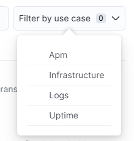

# ELK-ALERT-RULES-DOC

Repository ini berisi tentang cara membuat alert rules di dashboar Kibana

## Environment

**Elastic Version** : 8.3.2

**Kibana Version** : 8.3.2

**FLEET SERVER & AGENT HAS BEEN INSTALLED**

## Prerequisites

Pastikan FLEET SERVER & AGENT sudah terinstall dan sudah terkoneksi ke Kibana. Karena pada dokumentasi ini kita akan membuat alert rules untuk memonitoring system dari service yang terinstall di FLEET SERVER & AGENT.

Untuk dokumentasi lebih lengkap tentang cara menginstall FLEET SERVER & AGENT, silahkan kunjungi [Dokumentasi FLEET SERVER & AGENT](https://github.com/nvlannasik/ELK-FLEET-SERVER-DOC).

**Masukkan encryption key kibana**

Syarat untuk menggunakan alert rules di kibana adalah kita harus mengaktifkan & membuat encryption key kibana. Untuk itu kita lakukan update pada konfigurasi kibana yang sudah kita deploy sebelumnya.

Silahkan buka configurasi `kibana.yml` (pastikan sudah berada di folder `docker-elk`)

```bash
sudo nano kibana/config/kibana.yml
```

masukan script dibawah ini:

```
xpack.encryptedSavedObjects.encryptionKey: "something_at_least_32_characters"
```

Untuk encrypt key nya kita bebas mengisi dengan karakter apapun minimal 32 karakter atau lebih.

## Create Connector

Sebelum membuat alert rules kita buat terlebih dahulu connector untuk kibana.

```bash
Home Page Kibana -> Stack Management -> Rules and Connectors -> Connector -> Create Connector
```


Untuk jenis connector pilih Index


Masukan nama Connector & index sesuai dengan kebutuhan.

sebagai contoh kita pilih `Connector to Telegram` untuk nama connector dan `ini-log-alert` untuk index. Jangan lupa centang tombol `Refresh Index`. Jika sudah lalu Save

## Create Alert Rules

Selanjutnya kita membuat Alert Rules. Silahkan ke tab Rules. Lalu tekan tombol `Create Rule`





