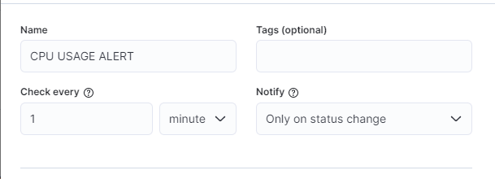
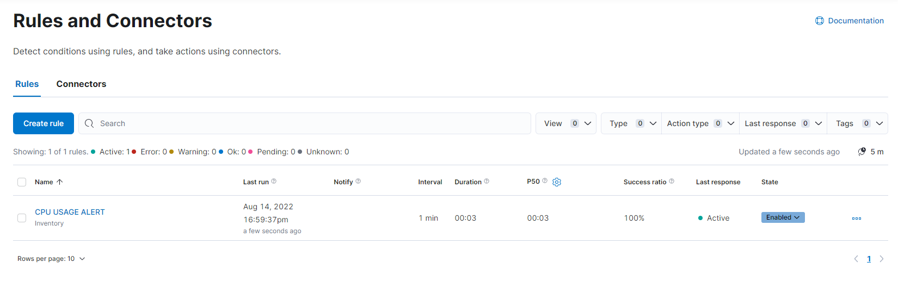

# ELK-ALERT-RULES-DOC

Repository ini berisi tentang cara membuat alert rules di dashboar Kibana

## Environment

**Elastic Version** : 8.3.2

**Kibana Version** : 8.3.2

**FLEET SERVER & AGENT HAS BEEN INSTALLED**

## Prerequisites

Pastikan FLEET SERVER & AGENT sudah terinstall dan sudah terkoneksi ke Kibana. Karena pada dokumentasi ini kita akan membuat alert rules untuk memonitoring system dari service yang terinstall di FLEET SERVER & AGENT.

Untuk dokumentasi lebih lengkap tentang cara menginstall FLEET SERVER & AGENT, silahkan kunjungi [Dokumentasi FLEET SERVER & AGENT](https://github.com/nvlannasik/ELK-FLEET-SERVER-DOC).

**Masukkan encryption key kibana**

Syarat untuk menggunakan alert rules di kibana adalah kita harus mengaktifkan & membuat encryption key kibana. Untuk itu kita lakukan update pada konfigurasi kibana yang sudah kita deploy sebelumnya.

Silahkan buka configurasi `kibana.yml` (pastikan sudah berada di folder `docker-elk`)

```bash
sudo nano kibana/config/kibana.yml
```

masukan script dibawah ini:

```
xpack.encryptedSavedObjects.encryptionKey: "something_at_least_32_characters"
```

Untuk encrypt key nya kita bebas mengisi dengan karakter apapun minimal 32 karakter atau lebih.

## Create Connector

Sebelum membuat alert rules kita buat terlebih dahulu connector untuk kibana.

```bash
Home Page Kibana -> Stack Management -> Rules and Connectors -> Connector -> Create Connector
```


Untuk jenis connector pilih Index


Masukan nama Connector & index sesuai dengan kebutuhan.

sebagai contoh kita pilih `Connector to Telegram` untuk nama connector dan `ini-log-alert` untuk index. Jangan lupa centang tombol `Refresh Index`. Jika sudah lalu Save

## Create Alert Rules

Selanjutnya kita membuat Alert Rules. Silahkan ke tab Rules. Lalu tekan tombol `Create Rule`


Pada bagian pertama ini, kita akan membuat nama dari Alert Rules yang mau kita definisikan. Sebagai Contoh, kita akan membuat Alert Rules `CPU USAGE`, maka saya definisikan untuk nama Alert Rules nya adalah `CPU USAGE ALERT`. Lalu untuk pengisian `Tags`, `Check Every`, & `Notify` bisa diisi sesuai kebutuhan.



Selanjutnya kita akan memilih `Rule Type`, dimana `Rule Type` ini berisi berbagai jenis dari semua service / use case yang ada di ELK Stack


Klik tombol `Filter by use case` untuk memfilter jenis alert rules yang kita inginkan. Sebagai contoh, kita akan membuat alert rules untuk memonitoring CPU Usage. Maka kita akan memilih `Infrastructure` untuk filter nya.


Setelah melakukan filter, maka akan muncul dua jenis metrik yang bisa kita gunakan untuk membuat alert rules. Kita akan memilih `Inventory` untuk membuat alert rules ini.


Setelah memilih jenis `use case` selanjutnya kita akan membuat sebuah condition sesuai dengan kebutuhan. Sebagai contoh, kita membuat rules dengan kondisi `CPU Usage` lebih besar atau sama dengan 10%.


Sesudah membuat condition, kita akan membuat action yang akan dijalankan ketika alert rules ini terjadi. Kita akan memilih `Connector` yang sudah kita buat sebelumnya. Pilih connector `Index`.


Atur `RUN When` sesuai kebutuhan dan Pilih `Index Connector` dengan `Connector` yang sudah kita buat sebelumnya


Pada `Document to Index`, masukan script dibawah ini:

```
{
    "Timestamp": "{{context.timestamp}}",
    "Alert_ID": "{{alert.id}}",
    "Condition": "{{alert.actionGroupName}}",
    "value": "{{context.value}}",
    "Reason": "{{context.reason}}"
}
```

Script tersebut merupakan contoh sederhana. Kita bisa mengisi sesuai kebutuhan.


Setelah selesai, klik tombol `Save` untuk menyimpan alert rules yang sudah kita buat. Maka akan muncul alert rules yang sudah kita buat.



Gambar dibawah merupakan contoh alert rules yang sudah terjadi. Alert rules ini akan terjadi ketika CPU Usage lebih besar atau sama dengan 10%. Dan akan membuat sebuah data di index `ini-log-alert` yang sudah kita buat sebelumnya.


## Integration to Telegram

Untuk mengintegrasikan alert rules yang sudah kita buat dengan telegram, bisa langsung mengikuti dokumentasi dari [ES-MODULE-ALERT](https://github.com/nvlannasik/ES-MODULE-ALERT)

## Authors

- [Ahmad Naoval Annasik](https://github.com/nvlannasik)
